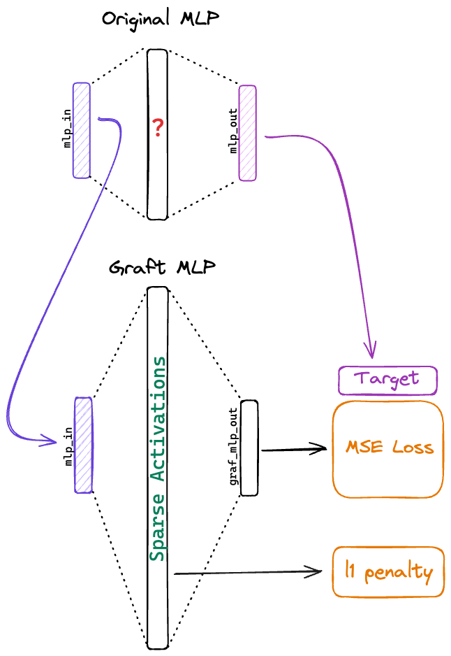

# ft_exp
Refactoring MLPs to be more interpretable by distilling them into larger, sparse MLPs.

The main analysis is in `analysis.ipynb`.

Training code is in `train.py` and model definitions are in `model.py`.

